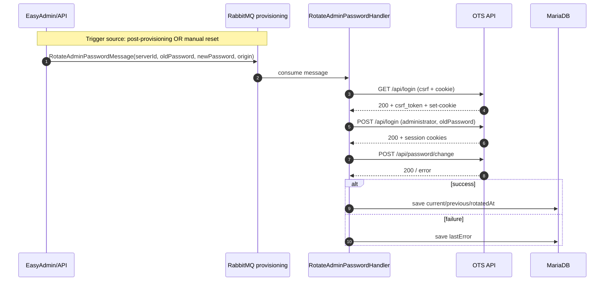

# Infratak MVP - Current State for AI

## Project Goal
Backend orchestrator that provisions per-user ATAK (OpenTAK) instances on AWS in a fully async, step-based, resumable flow.

## Business Docs
- Preliminary pricing (MVP): see `docs/pricing-mvp.md`
- Payments model (MVP): see `docs/payments-mvp.md`

## Deployment and Provisioning Makefiles

Two separate Makefiles are used on purpose:

1. `Makefile` (root) — application deployment only
  - scope: landing + admin runtime on an existing host
  - uses: `compose.prod.yml`, `.env.deploy`
  - typical targets: `setup`, `deploy-prod`, `tls-status`, `tls-renew`, `deploy-logs`

2. `Makefile.infra` (root) — AWS infrastructure provisioning only
  - scope: create/manage single EC2 host for the app
  - uses: AWS CLI, `.env.infra`, `user-data.sh`
  - typical targets: `create-instance`, `get-ip`, `status`, `destroy-instance`

Important separation:
- do not mix infrastructure provisioning with application deploy logic
- do not modify `infra/provisioning` for panel/landing deployment tasks

## Admin Panel Authentication

- Form login at `/admin/login`, logout at `/admin/logout`.
- Production access path: `https://infratak.com/admin` (HTTPS on landing nginx, then proxy to admin nginx).
- Roles: `ROLE_ADMIN` (full panel access), `ROLE_SUPER_ADMIN` (+ user management), `ROLE_USER` (client — own servers only).
- Role hierarchy: `ROLE_SUPER_ADMIN → ROLE_ADMIN → ROLE_USER`.
- `/admin` is accessible to `ROLE_USER` — clients land directly on their server list.
- User management CRUD available in the panel under "Administracja → Użytkownicy" (visible only to `ROLE_SUPER_ADMIN`).
- New users via console: `php bin/console app:admin:create-user <email> <password> [--super-admin]`
- Password reset via console: `php bin/console app:admin:set-password <email> <password>`

### Multi-tenancy (ROLE_USER vs ROLE_ADMIN)

`ROLE_USER` (client accounts) see a restricted view of the admin panel:

| Feature | ROLE_ADMIN | ROLE_USER |
|---|---|---|
| Server list | all servers | own servers only (filtered by `owner`) |
| Server detail page | full (all fields, logs) | limited (domain, status, subscription, OTS credentials) |
| Operation logs | visible | hidden |
| Technical fields (step, awsInstanceId, owner, runtime, etc.) | visible | hidden |
| OTS admin credentials | visible in detail | visible in detail |
| Actions on index | all | "Pokaż szczegóły" + "Reset admin password" |
| Admin-only menu items | visible | hidden |
| Subscriptions / Promo codes / Operation logs menu | visible | hidden |

### Production operations

Create admin user on production host:
`docker compose --env-file .env.deploy -f compose.prod.yml exec -T admin_php php bin/console app:admin:create-user <email> <password>`

Reset password for existing admin user on production host:
`docker compose --env-file .env.deploy -f compose.prod.yml exec -T admin_php php bin/console app:admin:set-password <email> <password>`

### Local dev default user

| field | value                       |
|-------|-----------------------------|
| email | `administrator@admin.local` |
| hasło | `admin123`                  |
| rola  | `ROLE_SUPER_ADMIN`          |

Utworzony jednorazowo przez:
`docker compose exec php php bin/console app:admin:create-user administrator@admin.local admin123 --super-admin`

## Stack in Use
- PHP 8.4+
- Symfony 7.3
- API Platform
- Symfony Messenger
- RabbitMQ
- MariaDB
- Docker
- AWS SDK for PHP (EC2, Route53, SSM)
- EasyAdmin
- Playwright (E2E testing)

## End-to-End Testing (Playwright E2E)

- Framework: Playwright + TypeScript
- Runs against: local dev stack (`http://127.0.0.1:8080`)
- Tests located in: `tests/e2e/`
- Config: `playwright.config.ts` with Chromium + HTML reporting
- NPM scripts:
  - `npm run pw:test` — run tests headless
  - `npm run pw:test:headed` — run tests with UI visible
  - `npm run pw:test:ui` — debug mode with Playwright inspector
  - `npm run pw:report` — open HTML report
- Current test suite:
  - `home.spec.ts` — landing page smoke test
  - `register.spec.ts` — registration error handling when mail transport is unavailable
- Make targets for convenience:
  - `make playwright-install` — install deps + Chromium
  - `make playwright-test` — run full test suite
  - `make playwright-test-ui` — debug mode
- Notes: Tests run against local compose before they start (no need for manual Docker startup)

## What Is Already Implemented

### Domain Model
- Server entity with fields:
  - id (UUID string)
  - name (unique)
  - domain
  - portalDomain
  - status
  - step
  - awsInstanceId
  - publicIp
  - lastError
  - lastRetryAt
  - sleepAt
  - lastDiagnoseStatus
  - lastDiagnoseLog
  - lastDiagnosedAt
  - otsAdminPasswordCurrent
  - otsAdminPasswordPrevious
  - otsAdminPasswordPendingReveal
  - otsAdminPasswordRotatedAt
  - createdAt
  - updatedAt
- Enums:
  - ServerStatus: creating, diagnosing, provisioning, cert_pending, ready, failed, deleted, stopped
  - ServerStep: none, ec2, wait_ip, dns, wait_dns, wait_ssm, provision, cert, cleanup

### API Layer (API Platform)
- Server resource operations:
  - GET /servers
  - GET /servers/{id}
  - POST /servers
  - DELETE /servers/{id}
- POST input DTO with validation:
  - name required
  - lowercase letters, digits, dash

### Processor Layer
- CreateServerProcessor:
  - validates input
  - delegates to shared ServerCreationService
  - creates Server row and dispatches async CreateServerMessage
- DeleteServerProcessor:
  - dispatches async DeleteServerMessage
  - removes row

### Shared Create Use Case
- ServerCreationService is the single creation entry point for both API and EasyAdmin:
  - initializes canonical values (name/domain/portalDomain/status/step)
  - persists Server
  - dispatches CreateServerMessage to provisioning queue

### Async Layer (Messenger)
- Message classes:
  - CreateServerMessage
  - DeleteServerMessage
  - DiagnoseServerMessage
  - StopServerMessage
  - ManualStopServerMessage
  - StartServerMessage
  - RotateAdminPasswordMessage
  - ServerProjectionMessage
- Handlers:
  - CreateServerHandler
  - DeleteServerHandler
  - DiagnoseServerHandler
  - StopServerHandler
  - ServerProjectionHandler
- Transport:
  - provisioning AMQP transport for AWS orchestration
  - projection AMQP transport for status/log projection updates
  - Diagnose/Stop/Start/Rotate password messages are routed to the existing provisioning transport (there is no third business queue)
- Retry behavior:
  - max attempts: 5
  - delay range: 10s-30s for orchestration retries
  - projection worker persists status and logs in DB
  - no failure transport is configured yet; after max retries messages are removed from transport

### Provisioning Orchestration
ProvisioningOrchestrator executes step-by-step flow:
1. ec2 (create instance)
2. wait_ip (poll instance IP)
3. dns (create Route53 records)
4. wait_dns (DNS readiness check)
5. wait_ssm (instance profile + SSM managed readiness diagnostics)
6. provision (SSM script for nginx + HTTP)
7. cert (SSM certbot command)
8. set ready status and clear step to none

Post-ready follow-up:
- when server reaches `ready`, the system queues `RotateAdminPasswordMessage` once (if `otsAdminPasswordRotatedAt` is null)
- password rotation is executed asynchronously by provisioning worker

Rules respected in implementation:
- no AWS calls in controllers/processors
- no provisioning in HTTP request cycle
- provisioning logic in service + async handler
- step-based resumable flow

### AWS Integration
- EC2:
  - stopInstances
  - runInstances
  - describeInstances
  - terminateInstances
  - launch is fail-fast when AWS_INSTANCE_PROFILE_NAME is missing
  - launch uses configured SecurityGroupIds and SubnetId
- Route53:
  - UPSERT A records for main and portal domains
- SSM:
  - sendCommand with AWS-RunShellScript
  - wait_ssm checks readiness and logs diagnostics (instanceId, hasIamProfile, ssmManaged)
  - InvalidInstanceId during SendCommand is treated as retryable race (agent/registration not ready yet)
  - provisioning and cert steps wait for real SSM completion before progressing
  - used for provisioning and certbot
- OTS API (direct HTTPS from worker):
  - `GET /api/login` to get csrf token + initial cookies
  - `POST /api/login` for admin session
  - `POST /api/password/change` for password rotation
  - implemented in dedicated `OtsApiClient` (worker-side REST call, no remote SSM script for password change)

### Provisioning Submodule
- Git submodule added at:
  - infra/provisioning
- Worker provisioning uses submodule assets as source of truth for:
  - provisioning.sh
  - nginx/ templates
- Execution model:
  - local read/render inside Symfony worker
  - remote execution through AWS SSM
- This keeps the orchestrator on SSM while reusing the provisioning repository contents.

### Order Flow (Promo Code Gated Registration)

Public flow for new clients: `/zamow` → `/zamow/rejestracja` → `/zamow/sukces`

- `/zamow` — server type selection (currently: OpenTAK Server)
- `/zamow/rejestracja?type=opentak` — registration form: firstName, lastName, phone, email, password, subdomain, **promoCode** (required)
- Promo code is validated against `PromoCode` entity; determines `durationDays` of server runtime
- On success:
  - If email already exists → use existing account (add server to it, don't change password)
  - If new email → create `User` with `ROLE_USER`, active=true
  - Create server via `ServerCreationService`
  - Call `SubscriptionService::purchase()` for `promoCode.durationDays` days
  - Increment `promoCode.usedCount`
  - Redirect to `/zamow/sukces` (credentials shown once via session)
- `/zamow/sukces` — one-time display of: server domain, portal domain, panel login, duration days

### Promo Code Entity (`PromoCode`)

| Field | Type | Description |
|---|---|---|
| `code` | string(64), unique | Uppercase; auto-uppercased on save |
| `durationDays` | int | Server runtime granted (default: 1) |
| `maxUses` | int\|null | Max redemptions; null = unlimited |
| `usedCount` | int | Redemptions so far |
| `expiresAt` | DateTimeImmutable\|null | Code expiry; null = never |
| `isActive` | bool | Can be deactivated without deleting |

Admin CRUD: "Promo codes" in menu (ROLE_ADMIN only). `findValidByCode()` in repository (case-insensitive, checks active + expiry).

### User Registration and Email Verification
- Public registration endpoint:
  - GET/POST `/register` (form + validation)
- Email verification flow:
  - User submits email + password
  - System generates 24h verification token
  - Email sent to user with verification link
  - User clicks link to activate account
  - Endpoint: GET `/verify-email` with token query param
- Error handling:
  - Invalid email: flash error + redirect to form
  - Password < 8 chars: flash error + redirect to form
  - Email already in use: flash error + redirect to form
  - **SMTP transport unavailable: user receives friendly error, no HTTP 500; created user/token are rolled back**
- Related entities:
  - `User` (email, password, roles, active flag, timestamps)
  - `EmailVerificationToken` (token hash, expiration, used flag, user association)
- Notes:
  - Passwords are hashed with bcrypt (automatic via security.yaml)
  - Inactive users cannot log in (verified by `UserActiveChecker`)
  - Token hash is stored (not plain token) for security

### Admin and Operations
- Health endpoint:
  - GET /health
- EasyAdmin:
  - /admin dashboard
  - dashboard cards for ready, failed, and in-progress servers
  - dashboard worker cards for provisioning/projection consumer visibility
  - server list/details/edit/delete
  - optional sleepAt datetime may be provided on create and is visible on index/detail
  - if sleepAt is set, panel schedules a future StopServerMessage for AWS stop
  - creating a new server from EasyAdmin queues provisioning via ServerCreationService
  - create form should expose only user-provided input such as name; system fields like lastError/status/step are managed asynchronously
  - enum fields such as status and step are rendered as badges in admin
  - action: retry provisioning (queues CreateServerMessage)
  - action: diagnose (queues DiagnoseServerMessage on provisioning transport)
  - action: start server (queues StartServerMessage)
  - action: reset admin password (queues RotateAdminPasswordMessage)
  - action: change admin password from server detail (accepts a provided password, queues RotateAdminPasswordMessage)
  - action: add subscription from server detail (50 PLN/day; extends `subscriptionPaidUntil`)
  - for `stopped` servers, actions retry/diagnose/reset password are hidden
  - diagnose sets status=diagnosing while running
  - diagnose writes final status ready or failed
  - step is cleared when server returns to ready; on failed diagnose the step remains at the failure point
  - current OTS admin password is stored in `otsAdminPasswordCurrent` after successful rotation and is visible in the server detail view **for both ROLE_ADMIN and ROLE_USER**
  - detail view shows OTS credentials as a table: login (`administrator`), password (with copy button), link "Otwórz panel OTS" (`https://<domain>/login`)
  - manual reset and manual change update the same stored password after worker success
  - password value in detail view has copy-to-clipboard button
  - portal (`portal.{subdomain}.infratak.com`) is a separate Flask app with no admin credentials — it is NOT included in password rotation (see BUG-009)
  - expired paid servers are stopped by `app:subscriptions:enforce`; servers not renewed within 30 days are queued for cleanup
  - renewing a stopped server queues `StartServerMessage`
  - domain and portalDomain are rendered as clickable links in detail view
  - operation log screen in admin menu
  - subscription purchase history screen in admin menu

### Password Rotation Flow (Current)

### Manual Start Flow (Current)
- Start action queues `StartServerMessage`.
- Worker starts EC2 instance, waits for public IP, updates Route53 A records again, then projects:
  - `status = ready`
  - `step = none`
  - refreshed `publicIp`
  - cleared `lastError` on success

### Projection Log Model
- New table/entity: server_operation_log
- Each provisioning/projection event stores:
  - level
  - status/step snapshot
  - message
  - JSON context
  - timestamp

### Docker Setup

**Dev** (`compose.yaml` + `compose.override.yaml`): single-role, `APP_ROLE=admin`, nginx on :8080.

**Production** (`compose.prod.yml`): dual-role split:
- `landing_php` + `landing_nginx` — `APP_ROLE=landing`, ports 80/443
- `admin_php` + `admin_nginx` — `APP_ROLE=admin`, port 8081
- `landing_nginx` proxies `/admin` → `admin_nginx` using a variable (`set $admin_upstream`) to defer DNS resolution (prevents crash on startup when admin_nginx not yet ready)
- Shared: `mariadb`, `rabbitmq`, `worker_provisioning`, `worker_projection`, `scheduler`

Worker details:
- workers use restart: unless-stopped
- provisioning and projection are long-running PHP processes and do not hot-reload code
- after changing enums, handlers, or messenger-related code, workers must be restarted

Main files:
- compose.yaml / compose.override.yaml (dev)
- compose.prod.yml (production)
- docker/php/Dockerfile
- docker/nginx/conf.d/landing.conf (production landing nginx)
- docker/nginx/conf.d/admin.conf (production admin nginx)

### Persistence
- Migration created for server table:
  - migrations/Version20260329164000.php

## Important Runtime Notes
- Fill real AWS values in .env before production use:
  - AWS_REGION
  - AWS_EC2_AMI_ID
  - AWS_ROUTE53_HOSTED_ZONE_ID
  - AWS_INSTANCE_PROFILE_NAME (if needed)
- Ensure worker is running to process async messages.
- For full async flow run dedicated workers:
  - docker compose up -d worker_provisioning worker_projection
- After backend changes affecting Messenger handlers/enums, restart workers:
  - docker compose restart worker_provisioning worker_projection
- Before opening /admin on a fresh environment, run migrations:
  - docker compose exec php php bin/console doctrine:migrations:migrate --no-interaction

Diagnose runtime notes:
- Diagnose is asynchronous and uses the provisioning queue/worker
- While diagnose is running, server status should be diagnosing
- A stuck diagnosing status with no updates usually indicates one of:
  - worker not running
  - worker running old code and needing restart
  - diagnose message exhausted retries and was removed from transport

## Known Gaps / Next Work
- Add automated tests (unit + integration + e2e flow checks)
- Harden idempotency for each external step
- Add richer status observability and structured logs
- Add Messenger failure transport for post-mortem recovery of exhausted messages
- Add CI pipeline for lint/test/migration checks
- Decide whether to continue evolving the submodule through SSM adapters or migrate more of its Makefile logic into native Symfony services
- Resolve AWS organization SCP blockers or use isolated account without SCP restrictions for MVP reliability

## AWS + SSM Lessons Learned
- IAM User and EC2 IAM Role are separate concerns:
  - IAM User (`infratak-provisioner`) is for backend/CLI API access
  - EC2 IAM Role in instance profile is required for in-instance SSM execution
- Missing EC2 instance profile causes downstream provisioning failures at SSM steps even if EC2 launch and DNS succeed
- AWS organization SCP can block required diagnostics APIs (for example DescribeInstanceInformation) regardless of attached IAM policy
- When SCP blocks required APIs, provisioning reliability is environment-constrained and this must be documented as an external blocker
